LR analysis
================

``` r
library(CellChat)
```

    ## Loading required package: dplyr

    ## 
    ## Attaching package: 'dplyr'

    ## The following objects are masked from 'package:stats':
    ## 
    ##     filter, lag

    ## The following objects are masked from 'package:base':
    ## 
    ##     intersect, setdiff, setequal, union

    ## Loading required package: igraph

    ## 
    ## Attaching package: 'igraph'

    ## The following objects are masked from 'package:dplyr':
    ## 
    ##     as_data_frame, groups, union

    ## The following objects are masked from 'package:stats':
    ## 
    ##     decompose, spectrum

    ## The following object is masked from 'package:base':
    ## 
    ##     union

    ## Loading required package: ggplot2

``` r
library(Seurat)
```

    ## Attaching SeuratObject

``` r
library(ComplexHeatmap)
```

    ## Loading required package: grid

    ## ========================================
    ## ComplexHeatmap version 2.8.0
    ## Bioconductor page: http://bioconductor.org/packages/ComplexHeatmap/
    ## Github page: https://github.com/jokergoo/ComplexHeatmap
    ## Documentation: http://jokergoo.github.io/ComplexHeatmap-reference
    ## 
    ## If you use it in published research, please cite:
    ## Gu, Z. Complex heatmaps reveal patterns and correlations in multidimensional 
    ##   genomic data. Bioinformatics 2016.
    ## 
    ## The new InteractiveComplexHeatmap package can directly export static 
    ## complex heatmaps into an interactive Shiny app with zero effort. Have a try!
    ## 
    ## This message can be suppressed by:
    ##   suppressPackageStartupMessages(library(ComplexHeatmap))
    ## ========================================

``` r
source("/home/qiwenhu/software/Cell-State-Atlas-2021/new_repo/Cell-State-Atlas-2021/SourceByTechnology/Trajectory/util.func.R")
```

## Load Data

### TAL - IMM communication - Extended Data Figure 13e

``` r
groupSize <- as.numeric(table(tal.imm.cellchat@idents))

module <- c("black", "pink", "brown", "yellow", "blue")
cell.types <- rownames(tal.imm.cellchat@net$count)
color.use <- setNames(color.table[match(cell.types, color.table$subclass.l2_label), ]$subclass.l2_color, cell.types)
color.use[is.na(color.use)] <- cell.types[is.na(color.use)]

cell.order <- c(c("B", "PL", "T", "NKT", "MAST", "MAC-M2", "cycMNP", "MDC", "cDC", "pDC", "ncMON", "N"), module)
int.matrix <- plot_communication(tal.imm.cellchat, module, cutoff=0.045, rescale = F, feature='weight', color.use=color.use,
                                 cell.order=cell.order)
```

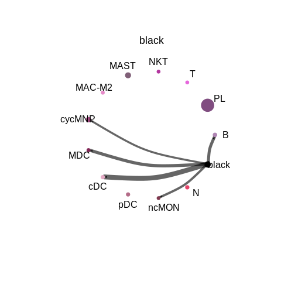<!-- -->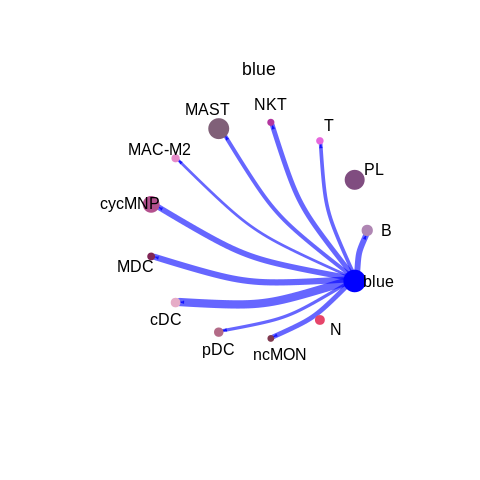<!-- -->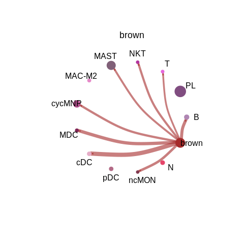<!-- -->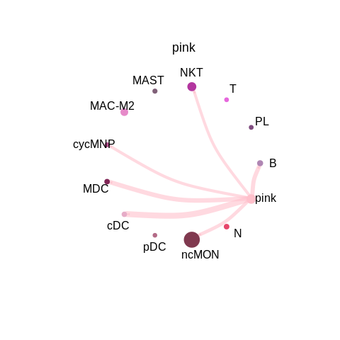<!-- -->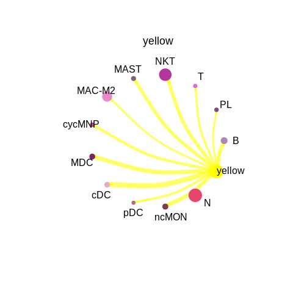<!-- -->

### Identify signals contribution - figure 6a-b

TAL-IMM

``` r
tal.imm.cellchat <- netAnalysis_computeCentrality(tal.imm.cellchat, slot.name = "netP")

plotSigHeatmap(tal.imm.cellchat, pattern="all", title="TAL/IMM", sel.group=module, 
               color.use=module, width=5, height=10)[[1]]
```

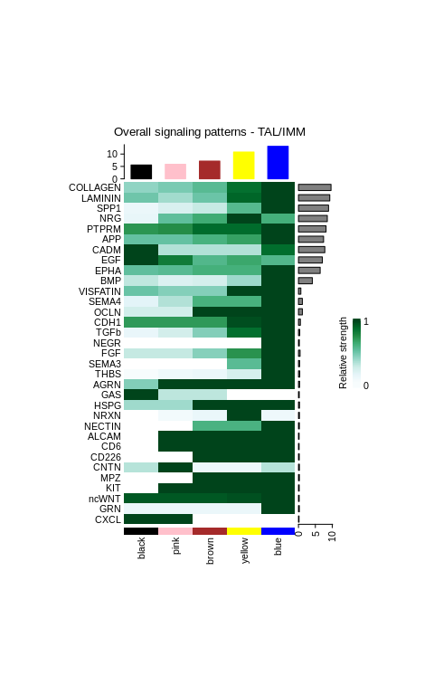<!-- -->

``` r
plotSigHeatmap(tal.imm.cellchat, pattern="out", title="TAL/IMM", sel.group=module, 
               color.use=module, width=5, height=10)
```

    ## $heatmap

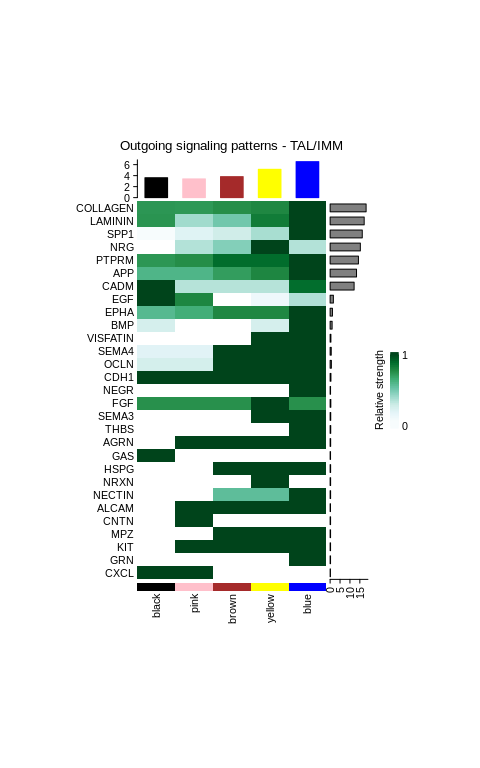<!-- -->

    ## 
    ## $mat
    ##               black      pink     brown     yellow      blue
    ## COLLAGEN 0.72064815 0.7159493 0.7471050 0.77404841 1.0000000
    ## LAMININ  0.72768652 0.3784722 0.4932231 0.82059708 1.0000000
    ## SPP1     0.04034802 0.1840360 0.2592782 0.36433243 1.0000000
    ## NRG              NA 0.3373733 0.4493743 1.00000000 0.3373733
    ## PTPRM    0.72231597 0.7496478 0.8771430 0.87714305 1.0000000
    ## APP      0.59190021 0.5919002 0.6965584 0.77683643 1.0000000
    ## CADM     1.00000000 0.3308381 0.3308381 0.33083810 0.8719370
    ## EGF      1.00000000 0.7790611        NA 0.09746943 0.3464050
    ## EPHA     0.57029092 0.6346565 0.7722674 0.77226745 1.0000000
    ## BMP      0.23411162        NA        NA 0.23411162 1.0000000
    ## VISFATIN         NA        NA        NA 1.00000000 1.0000000
    ## SEMA4    0.17838182 0.1783818 1.0000000 1.00000000 1.0000000
    ## OCLN     0.23765475 0.2376548 1.0000000 1.00000000 1.0000000
    ## CDH1     1.00000000 1.0000000 1.0000000 1.00000000 1.0000000
    ## NEGR             NA        NA        NA         NA 1.0000000
    ## FGF      0.74065709 0.7406571 0.7406571 1.00000000 0.7406571
    ## SEMA3            NA        NA        NA 1.00000000 1.0000000
    ## THBS             NA        NA        NA         NA 1.0000000
    ## AGRN             NA 1.0000000 1.0000000 1.00000000 1.0000000
    ## GAS      1.00000000        NA        NA         NA        NA
    ## HSPG             NA        NA 1.0000000 1.00000000 1.0000000
    ## NRXN             NA        NA        NA 1.00000000        NA
    ## NECTIN           NA        NA 0.5443306 0.54433059 1.0000000
    ## ALCAM            NA 1.0000000 1.0000000 1.00000000 1.0000000
    ## CNTN             NA 1.0000000        NA         NA        NA
    ## MPZ              NA        NA 1.0000000 1.00000000 1.0000000
    ## KIT              NA 1.0000000 1.0000000 1.00000000 1.0000000
    ## GRN              NA        NA        NA         NA 1.0000000
    ## CXCL     1.00000000 1.0000000        NA         NA        NA

``` r
plotSigHeatmap(tal.imm.cellchat, pattern="in", title="TAL/IMM", sel.group=module, 
               color.use=module, width=5, height=10)
```

    ## $heatmap

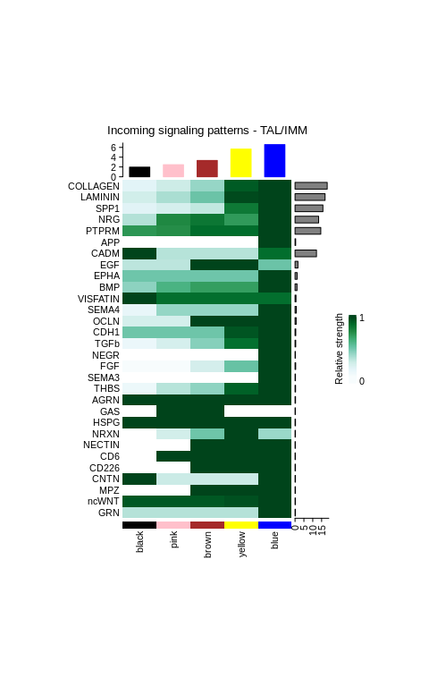<!-- -->

    ## 
    ## $mat
    ##               black       pink     brown    yellow      blue
    ## COLLAGEN 0.16904775 0.27085901 0.4071255 0.9322980 1.0000000
    ## LAMININ  0.25153076 0.35939557 0.5082982 0.9800349 1.0000000
    ## SPP1     0.17732553 0.23162671 0.3034869 0.8309068 1.0000000
    ## NRG      0.33869044 0.77032036 0.8385609 0.7074549 1.0000000
    ## PTPRM    0.72231597 0.74964785 0.8771430 0.8771430 1.0000000
    ## APP              NA         NA        NA        NA 1.0000000
    ## CADM     1.00000000 0.33083810 0.3308381 0.3308381 0.8719370
    ## EGF      0.31743478 0.31743478 1.0000000 1.0000000 0.5082718
    ## EPHA     0.50000000 0.50000000 0.5000000 0.5000000 1.0000000
    ## BMP      0.42700094 0.60849621 0.6915607 0.6915607 1.0000000
    ## VISFATIN 1.00000000 0.86791705 0.8679171 0.8679171 0.8679171
    ## SEMA4    0.14009811 0.41091229 0.4109123 0.4109123 1.0000000
    ## OCLN     0.23765475 0.23765475 1.0000000 1.0000000 1.0000000
    ## CDH1     0.50126775 0.50126775 0.5012677 0.9469552 1.0000000
    ## TGFb     0.11776721 0.23428213 0.4426873 0.8664284 1.0000000
    ## NEGR             NA         NA        NA        NA 1.0000000
    ## FGF      0.04012861 0.04012861 0.2407716 0.5184055 1.0000000
    ## SEMA3            NA         NA        NA        NA 1.0000000
    ## THBS     0.10934744 0.32804231 0.4254856 0.9125354 1.0000000
    ## AGRN     1.00000000 1.00000000 1.0000000 1.0000000 1.0000000
    ## GAS              NA 1.00000000 1.0000000        NA        NA
    ## HSPG     1.00000000 1.00000000 1.0000000 1.0000000 1.0000000
    ## NRXN             NA 0.25100554 0.5013389 1.0000000 0.3975226
    ## NECTIN           NA         NA 1.0000000 1.0000000 1.0000000
    ## CD6              NA 1.00000000 1.0000000 1.0000000 1.0000000
    ## CD226            NA         NA 1.0000000 1.0000000 1.0000000
    ## CNTN     1.00000000 0.27990968 0.2799097 0.2799097 1.0000000
    ## MPZ              NA         NA 1.0000000 1.0000000 1.0000000
    ## ncWNT    0.93884000 0.93884000 0.9388400 0.9631148 1.0000000
    ## GRN      0.33422715 0.33422715 0.3342271 0.3342271 1.0000000

TAL-STR

``` r
tal.stroma.cellchat <- netAnalysis_computeCentrality(tal.stroma.cellchat, slot.name = "netP")

plotSigHeatmap(tal.stroma.cellchat, pattern="all", title="TAL/STR", sel.group=module, 
               color.use=module, width=5, height=10)[[1]]
```

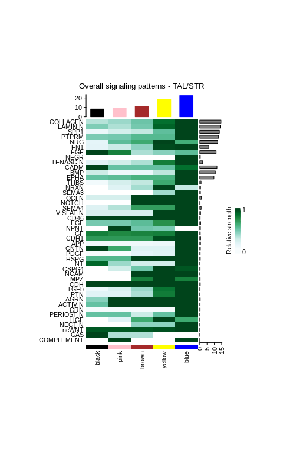<!-- -->

``` r
plotSigHeatmap(tal.stroma.cellchat, pattern="out", title="TAL/STR", sel.group=module, 
               color.use=module, width=5, height=10)
```

    ## $heatmap

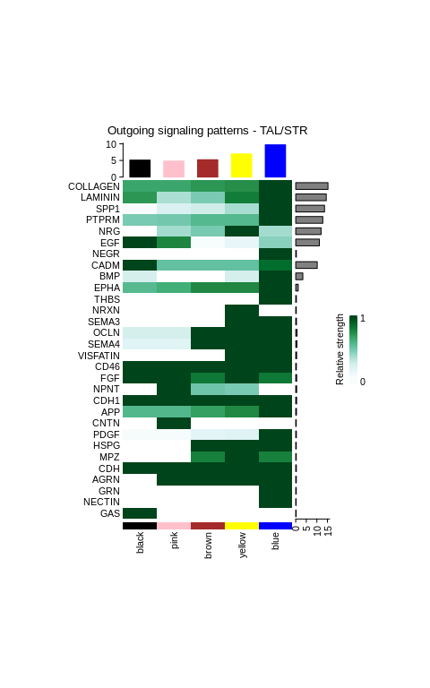<!-- -->

    ## 
    ## $mat
    ##              black      pink      brown    yellow      blue
    ## COLLAGEN 0.6630150 0.6649989 0.72123854 0.7476821 1.0000000
    ## LAMININ  0.7220819 0.3557562 0.47065378 0.8150871 1.0000000
    ## SPP1     0.0460792 0.2028270 0.25843054 0.3633230 1.0000000
    ## PTPRM    0.4730307 0.4909716 0.57470144 0.5747014 1.0000000
    ## NRG             NA 0.3732867 0.47926109 1.0000000 0.3732867
    ## EGF      1.0000000 0.7797067 0.03936549 0.1371694 0.4357422
    ## NEGR            NA        NA         NA        NA 1.0000000
    ## CADM     1.0000000 0.5270090 0.52700898 0.5270090 0.8718944
    ## BMP      0.2342398        NA         NA 0.2342398 1.0000000
    ## EPHA     0.5702909 0.6346565 0.77226745 0.7722674 1.0000000
    ## THBS            NA        NA         NA        NA 1.0000000
    ## NRXN            NA        NA         NA 1.0000000        NA
    ## SEMA3           NA        NA         NA 1.0000000 1.0000000
    ## OCLN     0.2376548 0.2376548 1.00000000 1.0000000 1.0000000
    ## SEMA4    0.1783818 0.1783818 1.00000000 1.0000000 1.0000000
    ## VISFATIN        NA        NA         NA 1.0000000 1.0000000
    ## CD46     1.0000000 1.0000000 1.00000000 1.0000000 1.0000000
    ## FGF      1.0000000 1.0000000 0.82923202 1.0000000 0.8292320
    ## NPNT            NA 1.0000000 0.50000000 0.4741133        NA
    ## CDH1     1.0000000 1.0000000 1.00000000 1.0000000 1.0000000
    ## APP      0.5811178 0.5811178 0.68709564 0.7690574 1.0000000
    ## CNTN            NA 1.0000000         NA        NA        NA
    ## PDGF     0.0462417 0.0462417 0.16520221 0.1842258 1.0000000
    ## HSPG            NA        NA 1.00000000 1.0000000 1.0000000
    ## MPZ             NA        NA 0.80000000 1.0000000 0.8000000
    ## CDH      1.0000000 1.0000000 1.00000000 1.0000000 1.0000000
    ## AGRN            NA 1.0000000 1.00000000 1.0000000 1.0000000
    ## GRN             NA        NA         NA        NA 1.0000000
    ## NECTIN          NA        NA         NA        NA 1.0000000
    ## GAS      1.0000000        NA         NA        NA        NA

``` r
plotSigHeatmap(tal.stroma.cellchat, pattern="in", title="TAL/STR", sel.group=module, 
               color.use=module, width=5, height=10)
```

    ## $heatmap

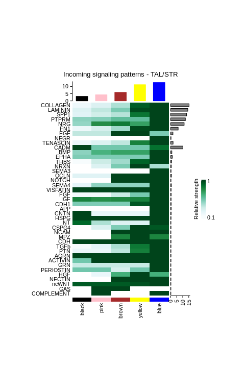<!-- -->

    ## 
    ## $mat
    ##                black      pink     brown    yellow      blue
    ## COLLAGEN   0.1630376 0.2573902 0.3955166 0.9302853 1.0000000
    ## LAMININ    0.2496431 0.3551493 0.5032497 0.9822064 1.0000000
    ## SPP1       0.2354375 0.3083482 0.3787078 0.8559036 1.0000000
    ## PTPRM      0.4730307 0.4909716 0.5747014 0.5747014 1.0000000
    ## NRG        0.4514882 0.7703204 0.8385609 0.7074549 1.0000000
    ## FN1        0.1680420 0.2845494 0.4298056 0.9816315 1.0000000
    ## EGF        0.3531808 0.3531808 1.0000000 1.0000000 0.5078386
    ## NEGR              NA        NA        NA        NA 1.0000000
    ## TENASCIN   0.1773988 0.2558699 0.3553515 0.8148278 1.0000000
    ## CADM       1.0000000 0.5270090 0.5270090 0.5270090 0.8718944
    ## BMP        0.4707965 0.6410797 0.7029841 0.7029841 1.0000000
    ## EPHA       0.5000000 0.5000000 0.5000000 0.5000000 1.0000000
    ## THBS       0.1093792 0.3281375 0.4255824 0.9124900 1.0000000
    ## NRXN              NA 0.2552974 0.5070000 1.0000000 0.4029641
    ## SEMA3             NA        NA        NA        NA 1.0000000
    ## OCLN       0.2376548 0.2376548 1.0000000 1.0000000 1.0000000
    ## NOTCH             NA        NA 1.0000000 1.0000000 1.0000000
    ## SEMA4      0.2120233 0.4636116 0.4636116 0.4636116 1.0000000
    ## VISFATIN   1.0000000 1.0000000 1.0000000 1.0000000 1.0000000
    ## FGF        0.1337620 0.1337620 0.3344051 0.5184055 1.0000000
    ## IGF        0.8093067 0.7679870 0.7901366 0.8093067 1.0000000
    ## CDH1       0.5012677 0.5012677 0.5012677 0.9469552 1.0000000
    ## APP               NA        NA        NA        NA 1.0000000
    ## CNTN       1.0000000 0.1949732 0.1949732 0.1949732 1.0000000
    ## HSPG       1.0000000 1.0000000 1.0000000 1.0000000 1.0000000
    ## NT         0.8967376 0.3975226 0.2510055 0.2510055 1.0000000
    ## CSPG4             NA 0.2650619 0.5012677 1.0000000 0.9469552
    ## NCAM              NA        NA 1.0000000 1.0000000 1.0000000
    ## MPZ               NA        NA 0.8000000 1.0000000 0.8000000
    ## CDH        1.0000000 1.0000000 1.0000000 1.0000000 1.0000000
    ## TGFb       0.1073543 0.2135415 0.4034056 0.8476214 1.0000000
    ## PTN        0.1794501 0.1794501 0.3589001 0.8205499 1.0000000
    ## AGRN       1.0000000 1.0000000 1.0000000 1.0000000 1.0000000
    ## ACTIVIN    0.5287831 1.0000000 1.0000000 1.0000000 1.0000000
    ## GRN        0.3342271 0.3342271 0.3342271 0.3342271 1.0000000
    ## PERIOSTIN  0.5293469 0.5293469 0.2799097 0.5293469 1.0000000
    ## HGF               NA 0.1831845 0.6544414 1.0000000 0.6544414
    ## NECTIN            NA        NA 1.0000000 1.0000000 1.0000000
    ## ncWNT      0.9388031 0.9388031 0.9388031 0.9630920 1.0000000
    ## GAS               NA 1.0000000 1.0000000        NA        NA
    ## COMPLEMENT        NA 1.0000000        NA        NA 1.0000000

### pathways

``` r
#cell.groups <- levels(tal.imm.cellchat@idents)
cell.order <- c(c("B", "PL", "T", "NKT", "MAST", "MAC-M2", "cycMNP", "MDC", "cDC", "pDC", "ncMON", "N"), module)
levels(tal.imm.cellchat@idents) <- cell.order
cell.groups <- levels(tal.imm.cellchat@idents)

for(g in module){
  print(netVisual_bubble(tal.imm.cellchat, sources.use=which(cell.order==g), 
                   targets.use = seq(length(cell.groups))[-which(cell.order %in% module)], remove.isolate = FALSE,
                   thresh=0.1))
}
```

    ## Comparing communications on a single object 
    ## 
    ## Comparing communications on a single object

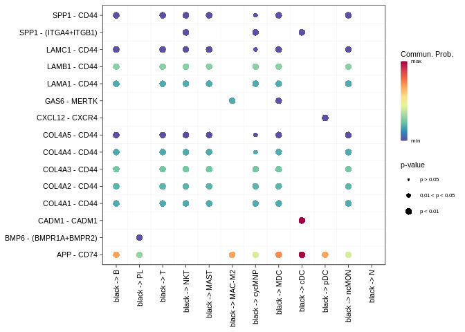<!-- -->

    ## Comparing communications on a single object

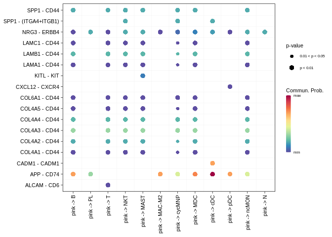<!-- -->

    ## Comparing communications on a single object

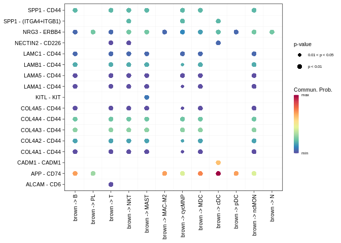<!-- -->

    ## Comparing communications on a single object

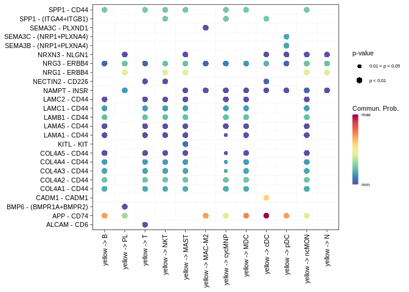<!-- -->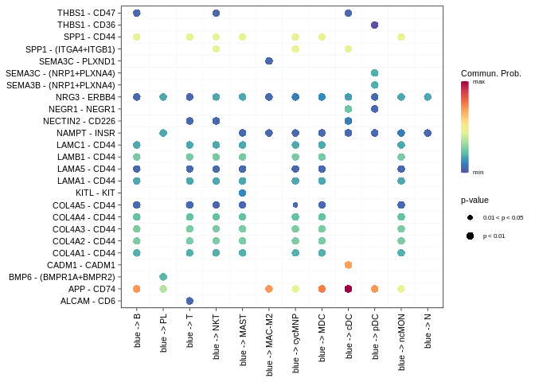<!-- -->
