Trajectory associated genes
================

``` r
library(Seurat)
library(slingshot)
library(pagoda2)
library(WGCNA)
library(ComplexHeatmap)
library(ggplot2)

source("/home/qiwenhu/software/Cell-State-Atlas-2021/new_repo/Cell-State-Atlas-2021/SourceByTechnology/Trajectory/util.func.R")
```

``` r
tal.meta <- tal.seurat@meta.data
tal.subclass <- data.frame(cells=rownames(tal.meta), subclass=tal.meta$subclass.l3)
subclass.color <- unique(data.frame(subclass=color.table$subclass.l3_label, color=color.table$subclass.l3_color))
tal.subclass.color <- merge(tal.subclass, subclass.color, by=c("subclass"))
colpal <- setNames(tal.subclass.color$color, tal.subclass.color$cells)
```

## TAL

### Embedding

``` r
tal.cellannot <- setNames(tal.seurat@meta.data$subclass.l3, rownames(tal.seurat@meta.data))

tal.p2$plotEmbedding(type='PCA', groups=tal.cellannot, embeddingType='umap', 
                    show.legend=F, mark.clusters=T,shuffle.colors=F,
                    mark.cluster.cex=1, alpha=0.1,
                    cex=0.2, colors=colpal)
```

    ## using supplied colors as is

``` r
lines(tal.sds, lwd = 1, col = 'black')
```

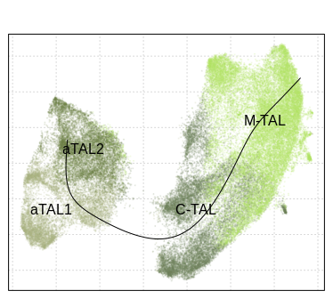<!-- -->

### Heatmap of top genes in modules - Fig 5b

``` r
cluster.col <- RColorBrewer::brewer.pal(n = 8, name = "Set2")
cluster.col <- data.frame(clusters=seq(1, 8, 1), col=cluster.col)
tal.cellannot <- tal.cellannot[names(tal.cellannot) %in% colnames(gene_mat_top)]

color.order <- c("black", "pink", "brown", "yellow", "blue")
module.plotsets <- module.genesets[module.genesets$gene %in% rownames(gene_mat_top), ]
module.plotsets$module <- factor(module.plotsets$module, levels=color.order)
module.plotsets <- module.plotsets[order(module.plotsets$module), ]
gene_mat_top <- gene_mat_top[match(module.plotsets$gene, rownames(gene_mat_top)), ]
row.df <- data.frame(clust=as.factor(module.plotsets$module))
col.df <- data.frame(celltype=as.factor(tal.cellannot[colnames(gene_mat_top)]))
rownames(col.df) <- colnames(gene_mat_top)


col.pt <- colpal[names(colpal) %in% names(tal.cellannot)]
col.pt <- col.pt[match(rownames(col.df), names(col.pt))]
names(col.pt) <- col.df[, 1]

col.row <- module.plotsets$module
names(col.row) <- module.plotsets$module


ha <- ComplexHeatmap::HeatmapAnnotation(celltype=col.df[, 1],
                                        which='column', show_annotation_name=FALSE, show_legend=T, border=T, 
                                        col=list(celltype=col.pt))

hl <- ComplexHeatmap::HeatmapAnnotation(cluster=names(col.row),
                                        which='row', show_annotation_name=FALSE, show_legend=T, border=T, 
                                        col=list(cluster=col.row))

hm <- ComplexHeatmap::Heatmap(t(scale(t(gene_mat_top))), cluster_columns = F, cluster_rows = F,show_column_names = F,border=T, 
                              name='expression', show_heatmap_legend = F, show_row_dend = F, 
                              show_row_names=F, top_annotation = ha, left_annotation=hl)
```

    ## `use_raster` is automatically set to TRUE for a matrix with more than
    ## 2000 columns You can control `use_raster` argument by explicitly
    ## setting TRUE/FALSE to it.
    ## 
    ## Set `ht_opt$message = FALSE` to turn off this message.

    ## 'magick' package is suggested to install to give better rasterization.
    ## 
    ## Set `ht_opt$message = FALSE` to turn off this message.

``` r
labeled.genes <- rownames(gene_mat_top)[round(seq(1,nrow(gene_mat_top),length.out = 20))]
labeled.genes <- c(labeled.genes, c("AQP1", "DCDC2", "HAVCR1", "LCN2", "PLSCR1", "PROM1", "UMOD", "VCAM1", "ITGB6", "EGF", "SLC12A1"))
hm + ComplexHeatmap::rowAnnotation(link = ComplexHeatmap::anno_mark(at = match(labeled.genes, rownames(gene_mat_top)), 
                                                                    labels = labeled.genes, labels_gp = grid::gpar(fontsize = 7)))
```

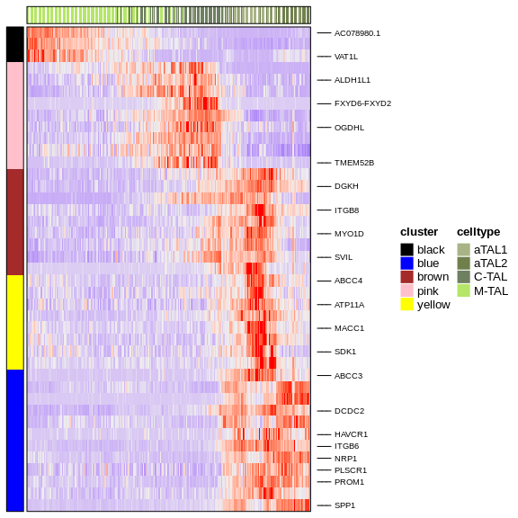<!-- -->

## plots of interesting genes - Extended Data Figure 11f

``` r
gene.list <- c("PLSCR1", "DCDC2", "HAVCR1", "AQP1", "VCAM1", "PROM1", "HAVCR1", "LCN2",
               "ITGB6")
intersected.genes <- intersect(gene.list, rownames(gene_mat_top))

condition <- setNames(tal.seurat@meta.data$condition.l1, rownames(tal.seurat@meta.data))
condition.disease <- condition[condition %in% c("AKI", "CKD")]

tal.subclass.color <- tal.subclass.color[tal.subclass.color$subclass %in% c("M-TAL",
                                         "C-TAL", "aTAL1", "aTAL2"), ]
tal.color <- unique(tal.subclass.color[, c(1, 3)])

conditions <- setNames(tal.seurat@meta.data$condition.l1, rownames(tal.seurat@meta.data))
condition.color <- c("#1F9950", "#CC5252", "#9D47B3")
gene_mat.cond <- gene_mat_top[, colnames(gene_mat_top) %in% names(condition.disease)]

module.cell.clusters <- module.cell.clusters[names(module.cell.clusters) %in% names(condition.disease)]

curve1.tal <- curve1.tal[names(curve1.tal) %in% names(module.cell.clusters)]
for(i in intersected.genes){
  #print(i)
  p1 <- plot_gene_psedotime(gene_mat_top, gene.name=i, pseudotime=curve1.tal, 
                            groups=module.cell.clusters, dot.size=0.5, alpha=0.05,
                            clpalatte=sort(unique(module.cell.clusters)), difftest.plot = F) +
    guides(colour = guide_legend(override.aes = list(alpha = 1)))
  
  p2 <- plot_gene_psedotime(gene_mat_top, gene.name=i, pseudotime=curve1.tal,
                            groups=conditions, dot.size=0.5, alpha=0.05, clpalatte=condition.color,
                            difftest.plot = F)
  print(cowplot::plot_grid(plotlist=list(p1, p2), ncol=2))
}
```

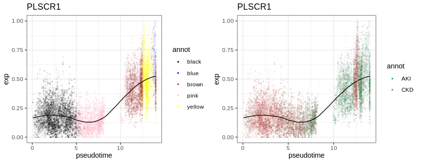<!-- -->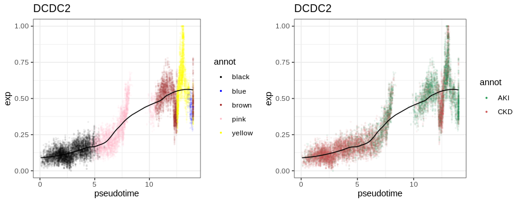<!-- -->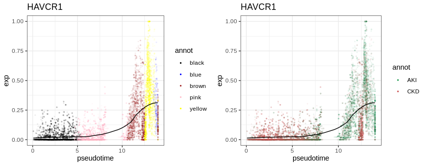<!-- -->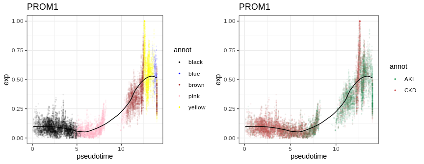<!-- -->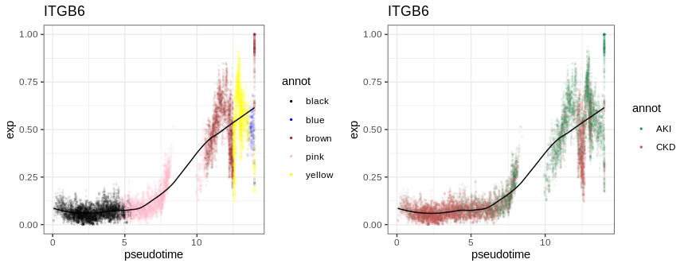<!-- -->

## PT

### Data processing

``` r
pt <- as.data.frame(slingPseudotime(sds))
mat <- t(pt.p2$counts)
cellWeights <- slingCurveWeights(sds)


curve1.pt <- pt[, 1]
names(curve1.pt) <- rownames(pt)
curve1.pt <- curve1.pt[names(curve1.pt) %in% colnames(mat)]
curve1.pt <- curve1.pt[!is.na(curve1.pt)]

modules <- unique(module.genesets$module)
ntop <- 10
gene.list <- lapply(1:length(modules), function(r){
  module <- modules[r]
  panel.deg <- module.deg[module.deg$module == module, ]
  panel.deg <- panel.deg[order(panel.deg$AUC, decreasing=T), ]
  panel.deg$gene[1:ntop]
  #module.deg[module.deg$module == module, ]$gene[1:ntop]
}) %>% unlist
gene.list <- unique(c(gene.list[!is.na(gene.list)], "PLSCR1", "DCDC2", "HAVCR1", "AQP1", "VCAM1", "PROM1", "HAVCR1", "LCN2"))

pt.meta <- pt.seurat@meta.data
pt.subclass <- data.frame(cells=rownames(pt.meta), subclass=pt.meta$subclass.l3)
subclass.color <- unique(data.frame(subclass=color.table$subclass.l3_label, color=color.table$subclass.l3_color))
pt.subclass.color <- merge(pt.subclass, subclass.color, by=c("subclass"))
colpal <- setNames(pt.subclass.color$color, pt.subclass.color$cells)

pt.cellannot <- setNames(pt.seurat@meta.data$subclass.l3, rownames(pt.seurat@meta.data))
```

### Heatmap of top genes in modules - Extended Data Figure 11c

``` r
gene_mat_top <- readRDS("/home/qiwenhu/hubmap/kidney/objects/trajetory/modules/PT/gene_mat_top.rds")
module.plotsets <- module.genesets[module.genesets$gene %in% rownames(gene_mat_top), ]
### ordering gene
module.plotsets <- module.plotsets[order(module.plotsets$module), ]

color.order <- c("black", "red", "magenta", "yellow", "turquoise")
module.plotsets$module <- factor(module.plotsets$module, levels=color.order)
module.plotsets <- module.plotsets[order(module.plotsets$module), ]

## ordering cells
curve1.pt <- curve1.pt[order(curve1.pt)]

cluster.col <- RColorBrewer::brewer.pal(n = 8, name = "Set2")
cluster.col <- data.frame(clusters=seq(1, 8, 1), col=cluster.col)
pt.cellannot <- pt.cellannot[names(pt.cellannot) %in% colnames(gene_mat_top)]

col.pt <- colpal[names(colpal) %in% names(pt.cellannot)]
gene_mat_top <- gene_mat_top[, colnames(gene_mat_top) %in% names(col.pt)]

row.df <- data.frame(clust=as.factor(module.plotsets$module))
col.df <- data.frame(celltype=as.factor(pt.cellannot[colnames(gene_mat_top)]))
rownames(col.df) <- colnames(gene_mat_top)
col.pt <- col.pt[match(rownames(col.df), names(col.pt))]
names(col.pt) <- col.df[, 1]


col.row <- module.plotsets$module
names(col.row) <- module.plotsets$module


ha <- ComplexHeatmap::HeatmapAnnotation(celltype=col.df[, 1],
                                        which='column', show_annotation_name=FALSE, show_legend=T, border=T, 
                                        col=list(celltype=col.pt))

hl <- ComplexHeatmap::HeatmapAnnotation(cluster=names(col.row),
                                        which='row', show_annotation_name=FALSE, show_legend=T, border=T, 
                                        col=list(cluster=col.row))

hm <- ComplexHeatmap::Heatmap(t(scale(t(gene_mat_top))), cluster_columns = F, cluster_rows = F,show_column_names = F,border=T, 
                              name='expression', show_heatmap_legend = F, show_row_dend = F, 
                              show_row_names=F, top_annotation = ha, left_annotation=hl)
```

    ## The automatically generated colors map from the minus and plus 99^th of
    ## the absolute values in the matrix. There are outliers in the matrix
    ## whose patterns might be hidden by this color mapping. You can manually
    ## set the color to `col` argument.
    ## 
    ## Use `suppressMessages()` to turn off this message.

    ## `use_raster` is automatically set to TRUE for a matrix with more than
    ## 2000 columns You can control `use_raster` argument by explicitly
    ## setting TRUE/FALSE to it.
    ## 
    ## Set `ht_opt$message = FALSE` to turn off this message.

    ## 'magick' package is suggested to install to give better rasterization.
    ## 
    ## Set `ht_opt$message = FALSE` to turn off this message.

``` r
labeled.genes <- rownames(gene_mat_top)[round(seq(1,nrow(gene_mat_top),length.out = 20))]
labeled.genes <- c(labeled.genes, c("PLSCR1","DCDC2","HAVCR1","AQP1","VCAM1","PROM1","HAVCR1","LCN2"))
hm + ComplexHeatmap::rowAnnotation(link = ComplexHeatmap::anno_mark(at = match(labeled.genes, rownames(gene_mat_top)), 
                                                                    labels = labeled.genes, labels_gp = grid::gpar(fontsize = 7)))
```

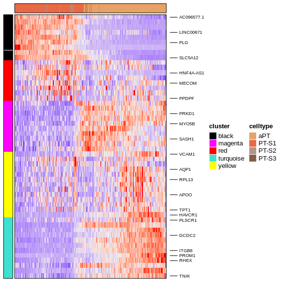<!-- -->

### plots of interesting genes

``` r
gene.list <- c("HAVCR1", "DCDC2", "PROM1", "PLSCR1")
condition <- setNames(pt.seurat@meta.data$condition.l1, rownames(pt.seurat@meta.data))
condition.disease <- condition[condition %in% c("AKI", "CKD")]
conditions <- setNames(pt.seurat@meta.data$condition.l1, rownames(pt.seurat@meta.data))
condition.color <- c("#1F9950", "#CC5252", "#9D47B3")
gene_mat.cond <- gene_mat_top[, colnames(gene_mat_top) %in% names(condition.disease)]

module.cell.clusters <- module.cell.clusters[names(module.cell.clusters) %in% names(condition.disease)]

curve1.pt <- curve1.pt[names(curve1.pt) %in% names(module.cell.clusters)]
for(i in gene.list){
  print(i)
  p1 <- plot_gene_psedotime(gene_mat_top, gene.name=i, pseudotime=curve1.pt, 
                            groups=module.cell.clusters, dot.size=0.5, alpha=0.05,
                            clpalatte=sort(unique(module.cell.clusters)), difftest.plot = F) +
    guides(colour = guide_legend(override.aes = list(alpha = 1)))
  
  p2 <- plot_gene_psedotime(gene_mat_top, gene.name=i, pseudotime=curve1.pt,
                            groups=conditions, dot.size=0.5, alpha=0.05, clpalatte=condition.color,
                            difftest.plot = F)
  print(cowplot::plot_grid(plotlist=list(p1, p2), ncol=2))
}
```

    ## [1] "HAVCR1"

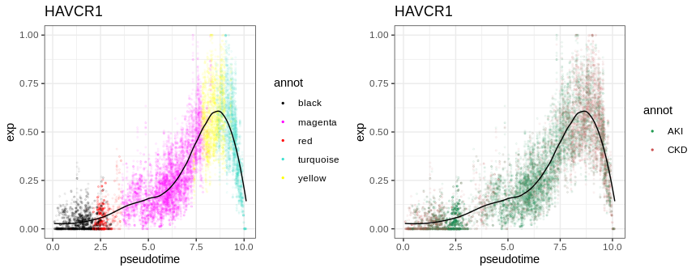<!-- -->

    ## [1] "DCDC2"

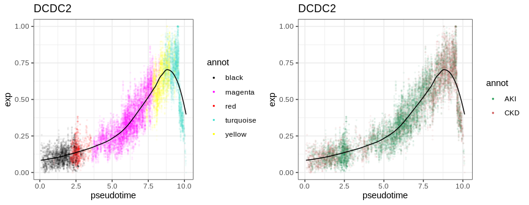<!-- -->

    ## [1] "PROM1"

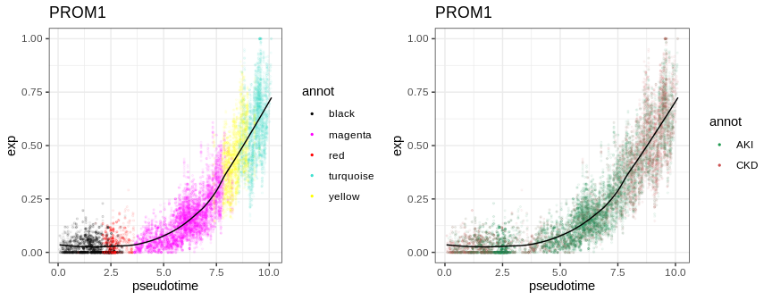<!-- -->

    ## [1] "PLSCR1"

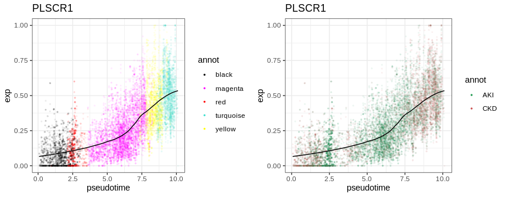<!-- -->
